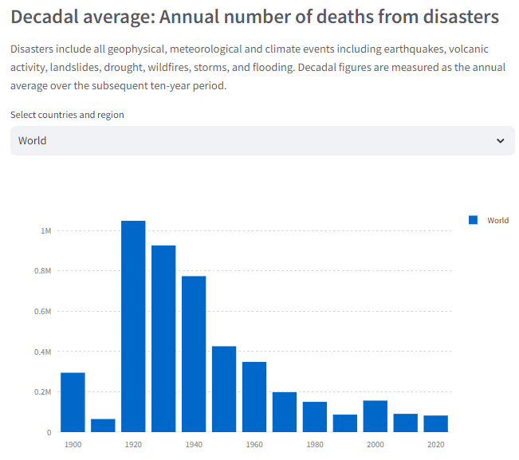
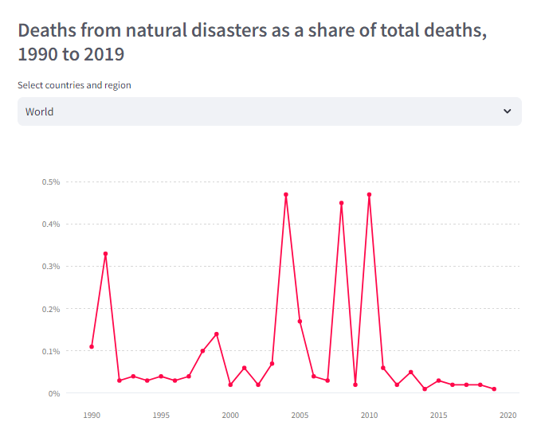
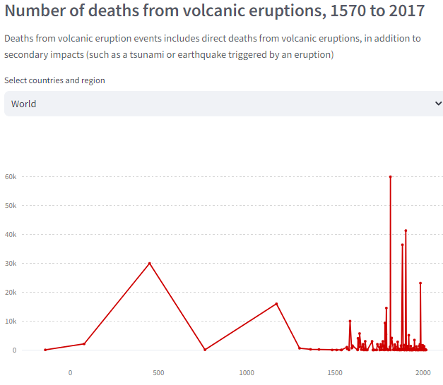

# Natural Disasters

### วิธีการใช้งาน

1. ทำการเปิด cmd แล้วเข้าถึงโฟล์เดอร์ที่จะเก็บโปรเจ็ค Ex: cd 'path/to/your/directory'
2. ทำการ git clone https://github.com/alexday11/Natural-Disasters.git
3. cd 'Natural-Disasters'
4. สามารถเริ่ม แอป streamlit run app.py

### ตัวอย่าง

